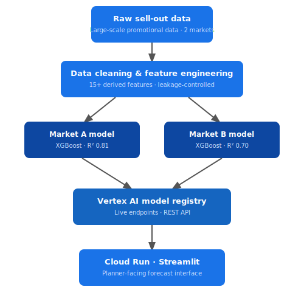

# FMCG Retail Analytics Portfolio

**Panos Emmanouilidis** · Data Scientist & Analytics Consultant  

---

## Featured Project: Promotional Analytics — Sell-Out Forecasting & Trade ROI Optimisation

### The Business Problem

A global FMCG manufacturer running thousands of trade promotions annually across Europe and Asia had no reliable way to forecast promotional sell-out volume or evaluate return on investment before committing trade spend. Planning was driven by intuition and historical precedent.

The consequences were measurable:

- Planners in **Market A (Europe)** were systematically **over-forecasting by 35%** — excess inventory and overstated investment cases
- Planners in **Market B (Asia)** were **under-forecasting by 103%** — significant demand unmet, growth opportunity unrealised
- **60–79% of promotions** across both markets missed their volume plan by more than 50% with no way to identify this risk in advance
- No pre-execution ROI visibility — no mechanism to know which promotions would generate positive incremental gross profit before committing spend

---

### What This Project Does

I took historical data from thousands of past promotions — what product was promoted, which retailer ran it, what type of deal it was (price cut, multi-buy, in-store display), how long it ran, and what budget was behind it. I then trained a machine learning model to learn the pattern between those inputs and the actual units sold at the till.

The result: give the model a promotion that hasn't happened yet, and it will predict how many units will sell and whether the promotion will make money — before a single penny is spent.

A planner fills in a simple form: product, retailer, promotion type, budget, duration. They get back a volume forecast and an ROI estimate in under 10 seconds. No data skills needed. No spreadsheet. No waiting.

---

### What Was Built

- **XGBoost sell-out forecasting model** — R² 0.81 (Market A), R² 0.70 (Market B), 5x improvement over linear baseline
- **Pre-execution ROI framework** — volume forecast and ROI estimate before any promotion runs
- **Full GCP Vertex AI deployment** — live prediction endpoints serving real-time forecasts via REST API
- **Streamlit planner application on Cloud Run** — business-facing interface requiring no technical skills
- **SHAP explainability layer** — identifies why a promotion is predicted to succeed or fail, in plain language
- **Data quality resolution** — cleaned and validated synthetically reproduced promotional data across two markets, preserving the statistical properties of the original 700K+ record dataset

---

### Key Business Outcomes

| Metric | Market A (Europe) | Market B (Asia) |
|--------|----------|----------|
| Model accuracy (R²) | **0.81** | **0.70** |
| Improvement over baseline | 5× | 5× |
| Planning bias identified | −35% over-forecast | +103% under-forecast |
| Promos missing plan by >50% | 60% | 79% |

---

### 🔗 Try It & Explore the Code

| | Link |
|---|---|
| 🚀 **Live Forecaster App** | [Open Streamlit App](https://unilever-promo-forecaster-128825737789.europe-west2.run.app) |
| 💻 **Full Technical Repository** | [fmcg-ds-technical-portfolio](https://github.com/Panosemmanouilidis2/fmcg-ds-technical-portfolio) |

---

### Tech Stack

| Layer | Technology |
|-------|-----------|
| Language | Python 3.10 |
| ML Modelling | XGBoost, LightGBM, Scikit-learn |
| Explainability | SHAP |
| Data Engineering | Pandas, NumPy |
| Cloud Platform | Google Cloud Platform (GCP) |
| Model Deployment | Vertex AI Model Registry, REST endpoints |
| Containerisation | Docker |
| Application | Streamlit on Cloud Run |

---

### Data & Confidentiality Notice

Developed against live commercial sell-out and sell-in data for a global FMCG manufacturer. Client identity, retail customer names, and raw datasets are not disclosed in line with professional confidentiality obligations. All data in this repository is synthetically generated to preserve the statistical properties of the original. Planning accuracy biases, ROI distributions, and mechanic performance rankings reflect real analytical findings. Methodology, deployment architecture, and business outcomes are genuine.

The input guidance shown in the app (e.g. "typical range 300–5,000 units") reflects the distribution of the training data — the ranges where the model has the strongest predictive confidence. Inputs outside these ranges are valid but represent extrapolation; treat those predictions as indicative.

All portfolio materials have been independently developed and do not contain proprietary data, trade secrets, or confidential business information belonging to any third party.

---

### About

10+ years of FMCG and retail analytics experience spanning manufacturer and retailer perspectives. Specialising in demand forecasting, promotional analytics, on-shelf availability, and end-to-end ML deployment.

📧 [Get in touch via LinkedIn](https://www.linkedin.com/in/panosemmanouilidis)

---

*Licensed under Creative Commons Attribution-NonCommercial 4.0. You may share and adapt for non-commercial purposes with attribution. Commercial use not permitted.*
